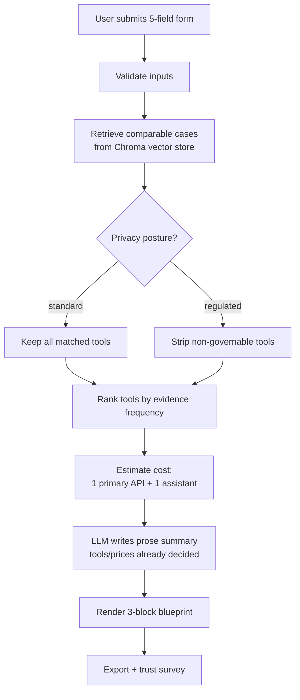

# Build Guide — PM, Ethics & Pitch: Weeks 1–2

*Companion to the kanban board's "PM, Ethics & Pitch" cards P.1–P.9. Written for someone who has never run a project or a user-research session before. Unlike the Epic 1–3 guides, there's no code here — the "deliverable" for each card is a document, a conversation, or a decision, and each one tells you exactly what to produce and how.*

---

## Card P.1 — Draft & sign off the Project Charter

**Depends on:** nothing · **Owner:** Joint · **Day:** 2 (Week 1)

### Goal in plain language
A **project charter** is a single page that both of you can point to any time someone (including future-you) asks "wait, are we building that too?" It exists to prevent scope drift — the exact problem this project's own v1 documents ran into before the reconciliation pass.

### Step-by-step

1. **Block 30–45 minutes together**, not async. Scope agreement needs a real conversation, not a shared doc edited separately.
2. **Copy the template below** into a new file, e.g. `00-Project-Charter.md`.
3. **Fill in each section out loud, together.** For the In-Scope/Out-of-Scope sections, you can lean on the reconciled scope statement already agreed in the Handbook (§1) — the exercise here is making sure you *both* can explain it in your own words, not just copy-paste it.
4. **Read the finished draft aloud to each other once, start to finish.** If either of you hesitates or disagrees on any line, that's a sign it's not actually settled — resolve it now, not in Week 3.
5. **Sign off**: both of you add your name and today's date at the bottom. This is a real project-management convention — it turns a draft into a commitment.

### Template

```markdown
# Project Charter — AI-Assisted Stack Architect (AASA)

**Problem:** [1-2 sentences: what problem are we solving, for whom?]

**One-line value:** [the "elevator pitch" sentence]

**In scope:**
- [bullet list]

**Explicitly out of scope:**
- [bullet list — be specific; vague scope boundaries are not real boundaries]

**Success criteria (how we'll know it worked):**
- [measurable target, e.g. "≥75% of 5-8 testers rate recommendations ≥4/5 trust"]

**Timeline:** [X weeks, key milestones]

**Roles:**
- Person A: [responsibilities]
- Person B: [responsibilities]

**Signed off by:** ___________ (A), ___________ (B)   **Date:** ___________
```

### How to verify this card is done
- The file exists, both names/dates are filled in, and you can both recite the "one-line value" from memory without looking at the doc.

---

## Card P.2 — Recruit 5–8 real test users

**Depends on:** nothing · **Owner:** Person B · **Day:** 1 (Week 1, ongoing through Week 3)

### Goal in plain language
You need real people — ideally actual early-stage founders or product leads — willing to give you 15–20 minutes twice: once for an early concept test (Week 2) and once for a full test of the working build (Week 3). Recruiting takes longer than people expect, which is why this starts on Day 1, not Week 3.

### Step-by-step

1. **Define your target profile in one sentence**: e.g. "Someone who has personally had to decide 'which AI tool should we use' for their team or startup in the last 6 months."
2. **List where you'll actually find them** — pick at least 3 channels so one falling through doesn't sink recruiting:
   - Your bootcamp's alumni/cohort network (often the fastest — people already trust you).
   - LinkedIn: a short post describing what you're testing and asking for volunteers.
   - Relevant online communities (e.g. Indie Hackers, r/startups, local startup Slack/Discord groups) — check each community's self-promotion rules before posting.
   - Direct personal network: 5 people you already know who fit the profile, asked directly.
3. **Write one outreach message** and reuse it everywhere (template below).
4. **Set up free scheduling** so people can pick a slot without back-and-forth emails — a free Calendly (or similar) link tied to a shared calendar works well for a 2-person team.
5. **Track candidates in a simple spreadsheet** (a Google Sheet is fine) with these columns: `Name`, `Contact`, `Fits profile? (Y/N)`, `Status (invited/scheduled/completed)`, `Session type (concept test / full test)`, `Notes`.
6. **Set a running target, not just a final one**: aim for 2–3 confirmed by end of Week 1 (for the Week 2 concept test), and 5–8 total confirmed before Day 20 (the full test).

### Outreach message template

> Hi [Name] — I'm building a small tool that recommends AI models/tools + a rough cost estimate based on real deployment data, as part of a project-management bootcamp capstone. I'm looking for 15–20 minutes of your time to try an early version and tell me honestly what's confusing or unconvincing. No prep needed, nothing to install. Would [specific day/time] or [specific day/time] work? Happy to work around your schedule.

### How to verify this card is done
- The tracking sheet has at least 3 rows marked "scheduled" by the end of Week 1.
- You have a reusable scheduling link and outreach message, not a one-off email you'd have to rewrite each time.

---

## Card P.3 — Define the 5-field intake / 3-block output schema

**Depends on:** P.1 · **Owner:** Joint · **Day:** 3 (Week 1)

### Goal in plain language
Before either of you writes a line of UI or backend code, agree on the **exact contract** between them: what data the form collects, in what format, and what shape the final output takes. This single document prevents the classic 2-person-team bug where Person B's form sends `"org_size": "Startup"` and Person A's backend expects `"org_size": "startup"` — a mismatch that's invisible until integration day, and painful to debug then.

### Step-by-step

1. Sit down together (or on a call) and literally write out, field by field, what each of the 5 inputs looks like: its name, its type, and 2–3 example values.
2. Do the same for the 3 output blocks: what data does each one need to render?
3. Save this as a schema document both of you can refer back to — this becomes the reference for Cards 1.1–1.4 (intake) and Card 1.4/Epic 2 (pipeline).

### Template

```markdown
# Intake → Output Schema (v1)

## Inputs (5 fields)
| Field | Type | Example values |
|---|---|---|
| workflow | string | "Customer Service", "Coding Assistant" |
| industry | string | "Technology", "Healthcare", "Any industry" |
| org_size | string (short key) | "solo", "startup", "smb", "mid", "ent" |
| privacy | string (short key) | "standard", "regulated" |
| budget | number (EUR/month) | 800 |

## Output (3 blocks)
| Block | Key data needed |
|---|---|
| A. Recommended stack | ranked list of tool ids + evidence count per tool |
| B. Cost forecast | primary_api {tool, monthly_eur, assumption}, assistant {tool, monthly_eur, assumption}, disclaimer |
| C. Case references | up to 4 cases: org, title, industry, source_url |
```

### How to verify this card is done
- Both of you can independently write down the exact key names (`org_size`, not `orgSize` or `size`) from memory — small naming inconsistencies here cause real integration bugs later.

---

## Card P.4 — Ethics: data-minimisation confirmation

**Depends on:** nothing · **Owner:** Person A · **Day:** 7 (Week 1)

### Goal in plain language
Confirm, in writing, that the app doesn't collect or store anything it doesn't need — no names, emails, or free-text that could identify a real person. This is a genuine ethics practice, not paperwork theatre: it's much easier to build privacy-by-design now than to retrofit it after Week 3's real user tests generate real data.

### Step-by-step

1. **Go through the 5 input fields one at a time** and ask: "could this identify a specific person?" (Workflow, Industry, Org Size, Privacy posture, Budget — none of these are personal data on their own.)
2. **Check every place the app writes data to disk** — at this point in the project that's `data/telemetry.log` (Card 3.3, once built) — and confirm it only logs enums/numbers (event name, timestamp, trust_score, elapsed_seconds), never free text a tester typed.
3. **Confirm there's no account system** — no login, no email collection, no persistent user identifier tying sessions together across visits.
4. **Confirm no third-party analytics SDK** is silently phoning data to an external company (the project deliberately uses a local log file for exactly this reason).
5. **Write a short, dated confirmation** — this becomes part of the Ethics Action Plan.

### Template

```markdown
## Week 1 Ethics Checkpoint — Data Minimisation
**Date:** ___________  **Owner:** Person A

- [x] No PII collected in any of the 5 intake fields.
- [x] Telemetry log (data/telemetry.log) contains only event names, timestamps, and numeric/enum values — no free text.
- [x] No account creation, login, or persistent user identifier.
- [x] No third-party analytics service receiving user data.

**Confirmed by:** ___________
```

### How to verify this card is done
- The checklist above exists, dated, with every box checked — or, if any box can't honestly be checked, that gap is written down as a known issue to fix before real user testing (Day 20), not silently ignored.

---

## Card P.5 — Diagram the full pipeline

**Depends on:** Card 2.1 (having a normalise step to diagram) · **Owner:** Joint · **Day:** 9 (Week 2)

### Goal in plain language
A one-glance diagram of input → filter → retrieve → cost → LLM helps you (a) spot missing steps before you build them, and (b) reuse the same image later in the pitch deck's architecture slide.

### Concepts you need first
**Mermaid** is a way of writing diagrams as plain text (a bit like writing a recipe) that a tool then draws as boxes and arrows for you — no dragging shapes around required.

### Step-by-step

1. Go to [mermaid.live](https://mermaid.live) — a free, no-signup online editor that renders Mermaid text live as you type.
2. Paste this diagram, which matches the actual pipeline built in Epic 2:



3. Click the **Export** / download button in mermaid.live to save it as a PNG — you'll reuse this exact image in Card P.18 (architecture slide).
4. Save the raw Mermaid text too, in a file like `docs/pipeline-diagram.mmd`, so it's easy to update later if the pipeline changes.

### How to verify this card is done
- You have both a rendered image and the raw `.mmd` text saved.
- Both of you agree the diagram matches what's actually being built — if it doesn't, that's useful signal that either the diagram or the plan needs updating.

---

## Card P.6 — Concept-test the prototype with 2–3 users

**Depends on:** Card P.2 · **Owner:** Person B · **Day:** 10 (Week 2)

### Goal in plain language
Before the real backend is fully wired, get 2–3 people to react to the existing prototype (`aasa-prototype.html`) so you can catch confusing or untrustworthy-feeling UI cheaply — fixing a layout problem now is much cheaper than fixing it after Week 3's full test.

### Step-by-step

1. **Schedule 15-minute sessions** with 2–3 of the people from your P.2 tracking sheet.
2. **Prepare a short script** (below) — the goal is to watch them react, not to pitch or explain the product to them.
3. **Share the prototype** (screen-share it, or send the HTML file if they can open it themselves) and **ask them to think out loud** as they use it.
4. **Take notes during the session** — don't rely on memory afterward. A simple notes doc per session is enough; you don't need recording software for this.
5. **Ask the closing questions** (below) at the end of every session, worded identically each time, so answers are comparable across sessions.

### Concept-test script

> "Thanks for taking the time. I'm going to show you an early prototype — there's no wrong way to react, and if anything is confusing, that's exactly what I want to hear. Go ahead and try filling in the 5 fields and generating a result, and just say out loud whatever you're thinking as you go."

**While they use it, watch for and note down:** where they pause, where they look confused, anything they say unprompted.

**Closing questions (ask every session, same wording):**
1. "On a scale of 1–5, how much would you trust a recommendation like this?"
2. "What's one thing that felt confusing or off?"
3. "Would you actually use something like this instead of Googling / asking in a forum?"

### How to verify this card is done
- You have written notes from 2–3 sessions, with all three closing-question answers recorded for each.

---

## Card P.7 — Debrief the concept test; patch UX

**Depends on:** Card P.6 · **Owner:** Person B · **Day:** 11 (Week 2)

### Goal in plain language
Raw notes from 2–3 sessions are only useful if you turn them into 2–3 concrete fixes within a day, while the sessions are still fresh. Waiting until Week 4 to "look at feedback later" is how user research gets ignored.

### Step-by-step

1. **Within 24 hours of the sessions**, re-read all your notes together.
2. **Group similar comments into themes** — a simple bullet list under headings works fine for 2–3 sessions (you don't need sticky notes or FigJam for this small a sample):
   ```
   Theme: "Wasn't sure what 'Regulated' meant"  (mentioned by 2/3 testers)
   Theme: "Wanted to see WHY a tool was recommended, not just its name" (3/3 testers)
   ```
3. **Pick the top 2–3 themes** — the ones mentioned by more than one person, or that blocked someone from finishing.
4. **For each, decide a specific, small UI fix** you can make in Epic 1/3's files today (e.g., add a tooltip explaining "Regulated" next to the privacy radio button — this is literally the `help=` parameter already shown in the Card 1.1 code).
5. **Make the fix, then note it** in a running changelog so you can point to it later ("we tested, we listened, we changed something") — this is good evidence for both your ethics workstream and your pitch deck's "Real Test Results" slide.

### How to verify this card is done
- At least 2 concrete UI changes exist that trace directly back to a named concept-test finding, logged in a changelog with a date.

---

## Card P.8 — Ethics: bias & dataset-skew model card

**Depends on:** nothing · **Owner:** Person A (supported by B) · **Day:** 13 (Week 2)

### Goal in plain language
A **model card** is a short, standard-format document (a practice that started at Google for describing what a model does and doesn't do well) that honestly documents a dataset or model's limitations, so anyone using it understands where it might mislead them. Here, the key fact to document is that the 3,023-case dataset skews toward enterprise productivity tools (Gemini/Workspace, M365 Copilot, Bedrock) rather than evenly representing the whole AI landscape — so recommendations will reflect that skew.

### Step-by-step

1. Create a file, e.g. `docs/model-card.md`.
2. Fill in the template below with facts you've already established while building Epic 2 — this card doesn't require new research, it requires writing down what you already know honestly.
3. Cross-check the ranking logic (Card 2.5's `rank_tools_by_frequency`) actually reflects real frequency counts from the data, not any manual reordering either of you might have been tempted to add "because it seems like a better answer" — the model card's credibility depends on this being true.
4. Link this doc from the product itself (a small "About this data" note near the results) — visibility is the point, not just having the document exist.

### Template

```markdown
# Model / Dataset Card — AASA Case Library

**Dataset:** 3,023 real AI deployment case rows (see Handbook §2 for source).

**Intended use:** retrieval of comparable real-world AI deployments to ground
tool recommendations in evidence, not to serve as a statistically
representative survey of "all AI adoption."

**Known limitations / bias:**
- Skews toward enterprise productivity tools (e.g. Microsoft 365 Copilot,
  Google Gemini for Workspace, Amazon Bedrock) rather than the agent-framework
  tooling (LangChain/CrewAI-style) sometimes assumed to dominate "AI adoption."
- No organisation-size field exists in the case data — recommendations are not
  filtered by company size; Org Size in the app is a separate, user-stated
  taxonomy used only for illustrative cost, not for filtering matches.
- Ranking reflects real-world adoption frequency in this dataset, which is not
  the same as "best tool for every situation" — it's evidence of what's been
  used, not a guarantee of fit.

**Fairness consideration:** because ranking is frequency-based and the data
skews toward large-company tools, smaller/newer vendors will be
systematically under-recommended even if well-suited to a given case. This is
disclosed to users, not hidden.
```

### How to verify this card is done
- The model card exists, is dated, and is linked somewhere visible in the actual product UI — not just filed away in a docs folder no user ever sees.

> **Status (2026-07-20): DONE.** `docs/model-card.md` created (v1, dated),
> filled with real figures computed from `data/use-cases.csv` — top-5 tools =
> ~45% of mentions, top-3 industries = ~40% of rows, 88.7% coverage, 24
> industries, no org-size field. Step 3 verified: `rank_tools_by_frequency()`
> in `app/logic/filter.py` is a plain `Counter.most_common` with no manual
> reordering. Surfaced in-product via an "ℹ️ About this data — bias & dataset
> skew" expander in `_render_methodology_block()` (`app/dashboard.py`),
> visible near the results, which references the full model card.

---

## Card P.9 — Full backend dry run

**Depends on:** Card 2.6 (all of Epic 2 built) · **Owner:** Joint · **Day:** 14 (Week 2)

### Goal in plain language
Before Week 3 puts a real UI in front of the backend, run the whole chain — normalise → embed/retrieve → filter → rank → cost → LLM summary — end to end on a handful of made-up test profiles, together, and read every field of the output like a skeptical stranger would.

### Step-by-step

1. **Agree on 3 test profiles in advance** that stress different paths through the logic, e.g.:
   - Profile 1: `workflow="Customer Service", industry="Technology", org_size="startup", privacy="standard", budget=800`
   - Profile 2: `workflow="Data Analysis", industry="Healthcare", org_size="ent", privacy="regulated", budget=5000` (tests the privacy filter actually removing consumer tools)
   - Profile 3: an intentionally odd combination (e.g. a workflow with very few matching cases) to see how gracefully the app degrades.
2. **Run each profile through `run_pipeline(...)`** exactly as shown at the end of `13-Build-Guide-Epic2-Retrieval-v1.md`, and print the full JSON output for each.
3. **Read the output together, out loud**, checking specifically: does Profile 2's recommended stack actually exclude consumer tools? Does the cost forecast show one primary API and one assistant, not a combined sum? Does the summary text avoid inventing any tool not in the ranked list?
4. **Log every defect you spot** in a simple running list (a markdown checklist or a free GitHub Issues board both work) with an owner and a one-line description — don't fix everything in this session, just capture it accurately.
5. **Decide, together, whether you're on track for Week 3.** This is a genuine go/no-go checkpoint, not just an exercise — if Profile 2's filter isn't working, that's a "must fix before Week 3" issue, not a "nice to have."

### How to verify this card is done
- All 3 profiles have been run and their full output read by both people.
- A dated defect list exists (even if short), each item with an owner.
- You've explicitly confirmed, out loud, whether Week 3's real user testing (5–8 testers already lined up per Card P.2) is realistic on schedule.

---

## Weeks 1–2 PM/Ethics — Done Checklist
- [ ] Signed project charter exists.
- [ ] Recruiting tracker has ≥3 scheduled testers.
- [ ] Intake/output schema document exists and both people agree on exact field names.
- [ ] Data-minimisation checklist is dated and checked.
- [ ] Pipeline diagram (image + `.mmd` source) exists.
- [ ] Concept-test notes exist for 2–3 sessions, with closing-question answers recorded.
- [ ] At least 2 UI fixes trace back to a named concept-test finding.
- [x] Model card exists, dated, and linked in-product. *(docs/model-card.md + "About this data" expander)*
- [ ] Full backend dry run completed on 3 profiles, with a dated defect list.

Continue to `16-Build-Guide-PM-Ethics-Week3-v1.md` next.
